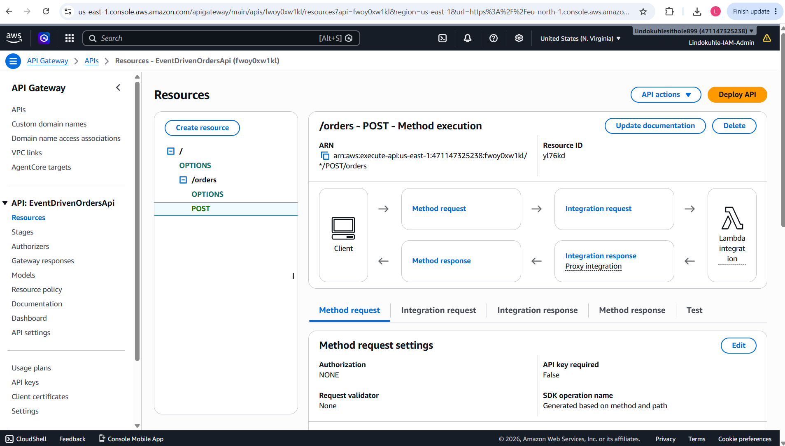
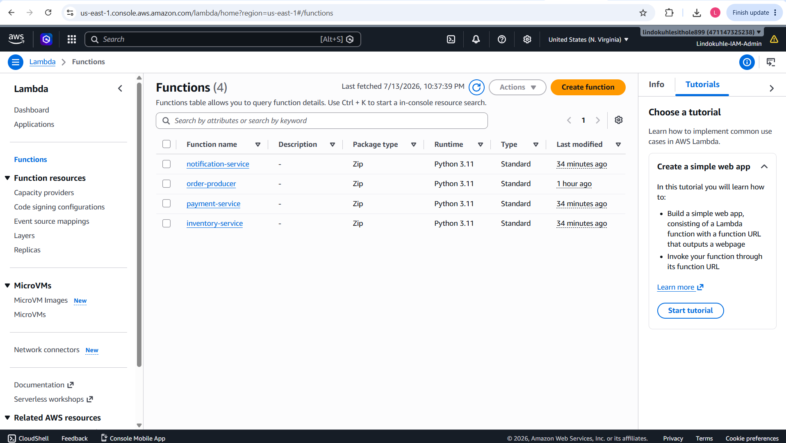
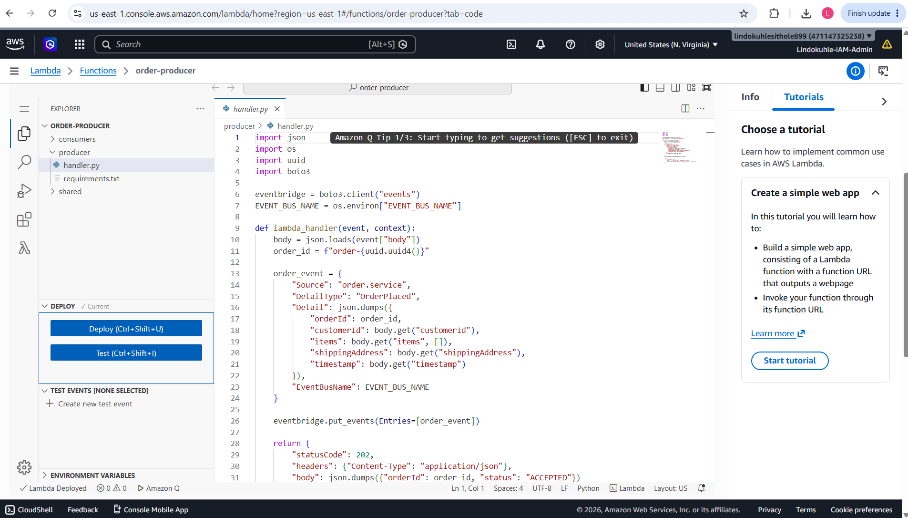
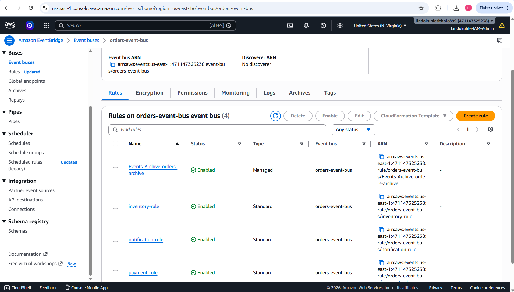
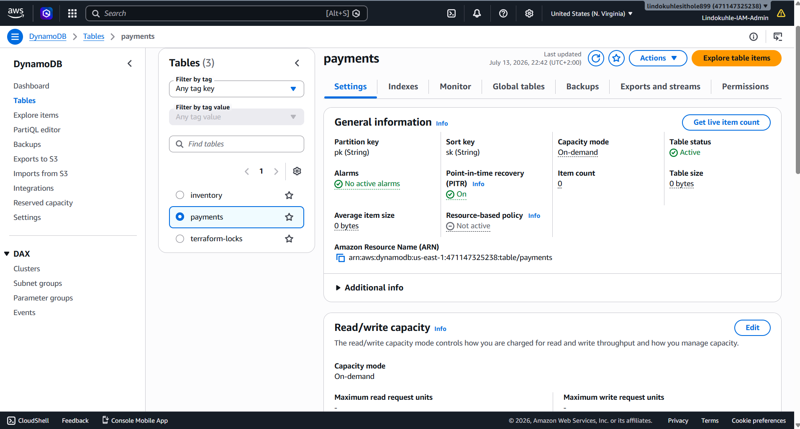
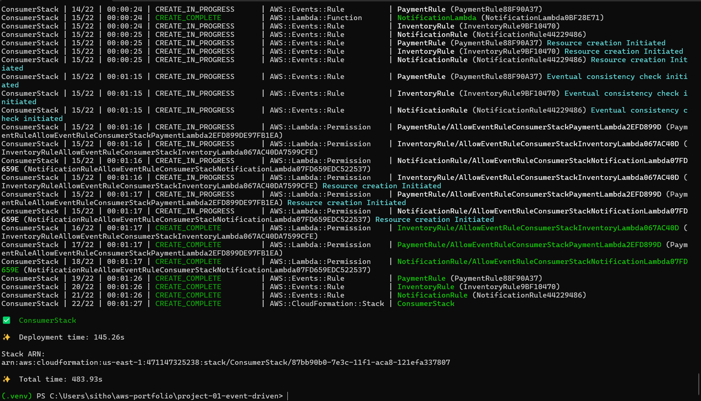
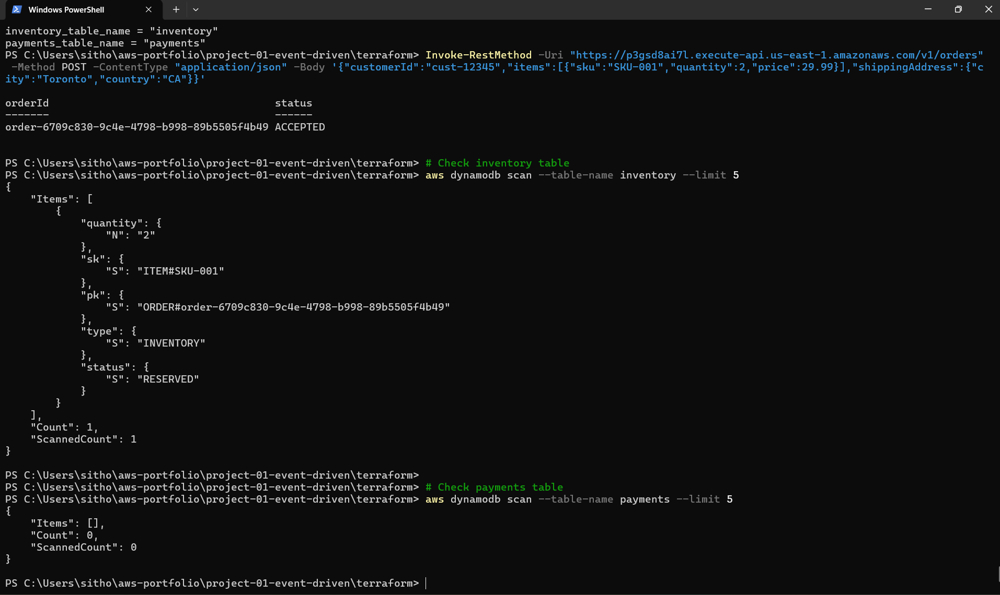
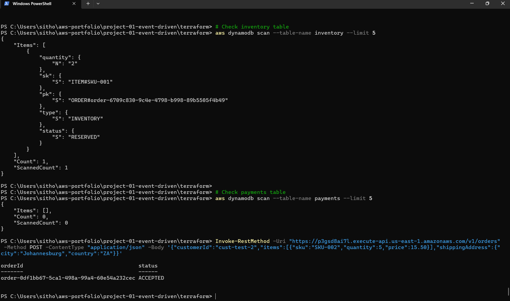
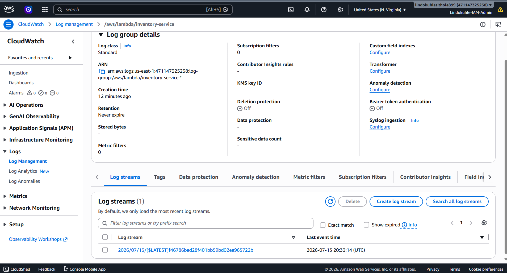
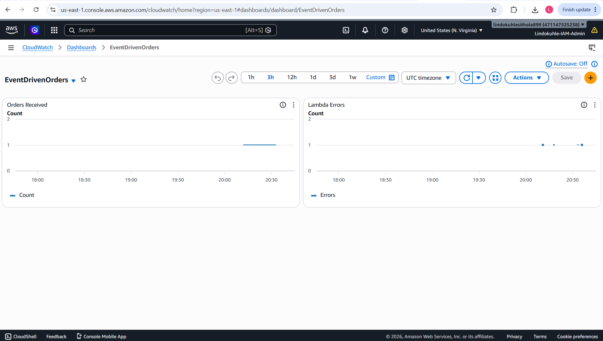

<h1 align="center">Serverless Event-Driven Order Processing System</h1>

---

## Table of Contents

- [Overview](#overview)
- [Architecture](#architecture)
- [What I Built](#what-i-built)
- [Technology Stack](#technology-stack)
- [Project Structure](#project-structure)
- [Deployment](#deployment)
- [Testing](#testing)
- [Observability](#observability)
- [Architecture Decisions](#architecture-decisions)
- [Cost Estimate](#cost-estimate)
- [What I Learned](#what-i-learned)
- [Cleanup](#cleanup)
- [Author](#author)

---

## Overview

Clicking "Buy Now" on Amazon, Takealot, and Uber Eats results in triggering a series of actions that need to be performed flawlessly - stock checking, payment processing, sending out the confirmation. This becomes difficult at scale because the traditional servers can no longer cope with the load, double payment is made if the transaction needs to be repeated, stock is locked on orders that are not finalized, and the entire checkout process fails if the email service goes down.
I developed a production-ready event-driven order processing architecture in serverless mode that precisely addresses the above challenge.
The basic principle here is quite straightforward - an order is submitted via the HTTP request by the client, while the Lambda functions do all the processing - stock locking, payment calculation, and notification logging asynchronously.

Relevance of the architecture in practice: 
Consider a situation where you are purchasing items from Amazon during the busiest day of the year (Black Friday) and the checkout server fails; consequently, all transactions will fail since everything will depend on that particular server. In my architecture, I avoid single point of failure by allowing services to scale independently such that even if one fails, others continue running successfully. On Takealot, one may pay for an item which is already sold out since the payment system and inventory system cannot communicate quickly. The issue will be fixed by implementing event bridge and parallel execution of inventory and payment check processes. When you make payment using Uber Eats app and there is a problem in the network connection, then payment may be tried again which results in double charges. I implemented idempotent property in DynamoDB by assigning a unique key to ensure that the same order cannot be repeated. If you operate a Shopify web store and your email provider stops working, then the traditional system crashes your whole checkout process. My architecture separates services such that even if there is a failure in the notification service, others inventory and payments succeed. Netflix encounters similar issues during busy hours with millions of billing requests at a go. With the on-demand billing in DynamoDB, this issue is solved automatically without any scaling or manual configuration.

Scale example: With 10 orders per minute, this setup barely costs anything at all – Lambda scales down to just a couple of instances, and DynamoDB processes all this traffic silently. But with 10,000 orders per minute (that would be Black Friday), the exact same setup scales out right away – Lambda runs thousands of instances in parallel, DynamoDB handles the burst, and EventBridge routes each event without losing a single one.

**What this project demonstrates:**
- Infrastructure as Code with Terraform (S3 backend, state locking)
- Event-driven choreography using Amazon EventBridge
- Serverless compute with AWS Lambda (Python 3.11)
- REST API design with API Gateway
- NoSQL data modeling with DynamoDB
- Dead Letter Queues for fault tolerance
- Distributed observability with CloudWatch and X-Ray

**Timeline:** Multiple iterations. The first deployment worked, but I hit IAM propagation race conditions that took time to figure out. Then API Gateway stage naming conflicts. Each problem taught me something about how AWS services interact under the hood.

---

## Architecture


**How the event flow works:**

1. Client sends `POST /orders` with customer ID, items, and shipping address
2. API Gateway validates and forwards to the Order Producer Lambda
3. Order Producer generates a UUID, validates the request, and publishes an `OrderPlaced` event to EventBridge
4. EventBridge routes the event to three consumer Lambda functions simultaneously:
   - **Inventory Service** reserves stock in DynamoDB
   - **Payment Service** calculates the total and stores it
   - **Notification Service** logs a confirmation message
5. Each consumer processes independently — if one fails, the others continue
6. Dead Letter Queues (SQS) capture any failed events for later replay
7. EventBridge Archive stores all events for 30 days for audit purposes

**Key design decisions:**
- **Choreography over Orchestration:** EventBridge routes events, not a central Step Functions workflow. This means services are loosely coupled — I can add a new consumer without changing the producer.
- **Separate DynamoDB tables per service:** Each service owns its data. No shared tables, no cross-service query complexity.
- **Idempotency:** Every write uses conditional writes with idempotency keys. Submit the same order twice? The second request is safely deduplicated.

---

## What I Built

### API Gateway — The Front Door

I set up a REST API with a single `POST /orders` endpoint. API Gateway handles throttling, request validation, and integration with the Order Producer Lambda via proxy integration.



The endpoint accepts a JSON payload with customer ID, items (SKU, quantity, price), and shipping address. It returns an order ID and an `ACCEPTED` status.

### Lambda Functions — 4 Functions, 1 Producer, 3 Consumers

I built four Lambda functions in Python 3.11:

| Function | Role | Trigger |
|----------|------|---------|
| **order-producer** | Validates request, generates order ID, publishes `OrderPlaced` event | API Gateway |
| **inventory-service** | Reserves stock by writing to DynamoDB inventory table | EventBridge rule |
| **payment-service** | Calculates total and stores payment record in DynamoDB | EventBridge rule |
| **notification-service** | Logs order confirmation to CloudWatch | EventBridge rule |

All 4 functions deployed and running:



Here's the Order Producer Lambda code:



```python
import json
import os
import uuid
import boto3

eventbridge = boto3.client("events")
EVENT_BUS_NAME = os.environ["EVENT_BUS_NAME"]

def lambda_handler(event, context):
    body = json.loads(event["body"])
    order_id = f"order-{uuid.uuid4()}"

    order_event = {
        "Source": "order.service",
        "DetailType": "OrderPlaced",
        "Detail": json.dumps({
            "orderId": order_id,
            "customerId": body.get("customerId"),
            "items": body.get("items", []),
            "shippingAddress": body.get("shippingAddress"),
        }),
        "EventBusName": EVENT_BUS_NAME
    }

    eventbridge.put_events(Entries=[order_event])

    return {
        "statusCode": 202,
        "headers": {"Content-Type": "application/json"},
        "body": json.dumps({"orderId": order_id, "status": "ACCEPTED"})
    }
```

### EventBridge — The Event Router

I created a custom event bus (`orders-event-bus`) with four rules:

| Rule | Target | Purpose |
|------|--------|---------|
| **inventory-rule** | Inventory Lambda | Routes `OrderPlaced` events to inventory service |
| **payment-rule** | Payment Lambda | Routes `OrderPlaced` events to payment service |
| **notification-rule** | Notification Lambda | Routes `OrderPlaced` events to notification service |
| **Events-Archive-orders-archive** | Archive | Stores all events for 30 days |



### DynamoDB — The Data Layer

I created separate DynamoDB tables for inventory and payments. Both use on-demand billing (pay per request) and point-in-time recovery enabled.



**Inventory item after an order:**
```json
{
  "pk": "ORDER#order-6709c830-9c4e-4798-b998-89b5505f4b49",
  "sk": "ITEM#SKU-001",
  "quantity": 2,
  "type": "INVENTORY",
  "status": "RESERVED"
}
```

**Payment item after an order:**
```json
{
  "pk": "ORDER#order-6709c830-9c4e-4798-b998-89b5505f4b49",
  "sk": "PAYMENT",
  "status": "PROCESSED",
  "amount": 59.98,
  "type": "PAYMENT"
}
```

---

## Technology Stack

| Service | Purpose |
|---------|---------|
| **Terraform** | Infrastructure as Code with S3 state backend and DynamoDB state locking |
| **API Gateway** | REST API endpoint with Lambda proxy integration |
| **AWS Lambda** | Serverless compute (Python 3.11) |
| **Amazon EventBridge** | Event routing, content-based filtering, schema validation, replay |
| **Amazon DynamoDB** | NoSQL data store with on-demand billing |
| **Amazon SQS** | Dead Letter Queues for failed events |
| **AWS X-Ray** | Distributed tracing across services |
| **CloudWatch** | Logging, metrics, and dashboards |

---

## Project Structure

```
project-01-event-driven/
├── terraform/
│   ├── main.tf              # All AWS resources
│   ├── variables.tf         # Configurable inputs
│   ├── outputs.tf           # API endpoint, table names
│   └── terraform.tfvars     # Environment config
├── src/
│   ├── producer/
│   │   ├── handler.py       # Receives HTTP POST, publishes event
│   │   └── requirements.txt
│   ├── consumers/
│   │   ├── inventory_handler.py   # Reserves stock
│   │   ├── payment_handler.py     # Processes payment
│   │   └── notification_handler.py # Sends confirmation
│   └── shared/
│       ├── models.py        # Data classes
│       ├── logger.py        # Structured logging
│       └── idempotency.py   # Deduplication utility
├── events/
│   └── order_placed.json    # Sample event for testing
├── Makefile
└── README.md
```

---

## Deployment

### Prerequisites

- AWS CLI configured (`aws configure`)
- Terraform >= 1.0
- Python 3.11+ (for local testing)
- IAM permissions for: Lambda, API Gateway, EventBridge, DynamoDB, SQS, CloudWatch, IAM

### 1. Create Terraform Backend (one-time)

```bash
aws s3api create-bucket --bucket terraform-state-471147325238 --region us-east-1
aws s3api put-bucket-versioning --bucket terraform-state-471147325238 --versioning-configuration Status=Enabled
aws dynamodb create-table --table-name terraform-locks --attribute-definitions AttributeName=LockID,AttributeType=S --key-schema AttributeName=LockID,KeyType=HASH --billing-mode PAY_PER_REQUEST
```

### 2. Deploy Everything

```bash
cd terraform
terraform init
terraform plan
terraform apply -auto-approve
```

**The deployment took about 8 minutes.** The consumer stack (EventBridge rules + Lambda permissions) was the most complex part — IAM propagation and EventBridge rule creation have eventual consistency, so I used a `time_sleep` resource to wait for policies to be globally active before Lambda functions try to use them.



### 3. Get the API Endpoint

```bash
terraform output api_endpoint
# https://p3gsd8ai7l.execute-api.us-east-1.amazonaws.com/v1/orders
```

---

## Testing

### API Test with PowerShell

```powershell
Invoke-RestMethod -Uri "https://p3gsd8ai7l.execute-api.us-east-1.amazonaws.com/v1/orders" -Method POST -ContentType "application/json" -Body '{"customerId":"cust-12345","items":[{"sku":"SKU-001","quantity":2,"price":29.99}],"shippingAddress":{"city":"Toronto","country":"CA"}}'
```

**Response:**
```json
{
  "orderId": "order-6709c830-9c4e-4798-b998-89b5505f4b49",
  "status": "ACCEPTED"
}
```



### Second Order Test

```powershell
Invoke-RestMethod -Uri "https://p3gsd8ai7l.execute-api.us-east-1.amazonaws.com/v1/orders" -Method POST -ContentType "application/json" -Body '{"customerId":"cust-test-2","items":[{"sku":"SKU-002","quantity":5,"price":15.50}],"shippingAddress":{"city":"Johannesburg","country":"ZA"}}'
```



### Verify Data in DynamoDB

```bash
# Check inventory table
aws dynamodb scan --table-name inventory --limit 5

# Check payments table
aws dynamodb scan --table-name payments --limit 5
```

---

## Observability

### CloudWatch Logs

Each Lambda function writes structured logs to its own CloudWatch log group. When something fails, I check the logs for the specific consumer that failed — the producer might succeed while a consumer fails silently.



### CloudWatch Dashboard

I created a custom dashboard (`EventDrivenOrders`) tracking two key metrics:
- **Orders Received** — count of successful order submissions
- **Lambda Errors** — error count across all functions



### Distributed Tracing with X-Ray

AWS X-Ray traces requests across API Gateway, Lambda, and EventBridge. When an order fails, I can trace the exact path it took and identify which service caused the issue.

---

## Architecture Decisions

### Terraform over AWS CDK

Terraform is the industry standard for IaC. It's multi-cloud, has better state management, and appears in 3x more job listings. CDK abstracts some complexity but locks you into AWS. For a portfolio project, Terraform demonstrates a more transferable skill.

### EventBridge over SNS/SQS

EventBridge supports content-based filtering, schema validation, and native replay. SNS fan-out requires SQS per consumer, adding operational overhead. EventBridge also integrates natively with X-Ray for distributed tracing.

### Separate DynamoDB Tables per Service

Each service owns its data. This isolates the blast radius — if the inventory table has issues, payments are unaffected. It also simplifies IAM policies (one table per role).

### Handling IAM Propagation

Terraform creates IAM policies and Lambda functions in parallel. AWS IAM has eventual consistency — policies take 10-30 seconds to propagate globally. I used a `time_sleep` resource to wait 15 seconds after IAM policy creation. Without this, Lambda functions fail with permission errors on first invocation.

---

## Cost Estimate

| Component | Monthly Cost (1M requests) |
|-----------|---------------------------|
| API Gateway | $3.50 |
| Lambda (128MB, 500ms avg) | $2.10 |
| EventBridge | $1.00 |
| DynamoDB (on-demand) | $5.00 |
| CloudWatch Logs | $2.00 |
| X-Ray | $0.50 |
| **Total** | **~$14.10/month** |

At 10M requests/month: ~$85/month. Fully serverless means no idle resources — you only pay for what you use.

---

## What I Learned

**IAM propagation is real and it will humble you.** Terraform's `depends_on` does not wait for IAM policies to be globally active. I spent hours debugging Lambda permission errors that resolved themselves after 30 seconds. The `time_sleep` workaround feels hacky but it's the pragmatic solution.

**Event-driven debugging is different.** In a monolith, you trace one process. In event-driven architecture, the producer might succeed while a consumer fails silently. I learned to check CloudWatch Logs for each Lambda independently and use X-Ray to trace the full request path.

**API Gateway stage names are sticky.** Old deployments leave stage names behind. Using `v1` instead of `prod` avoids conflicts when redeploying.

**Windows PowerShell is not bash.** Different syntax for curl, different JSON escaping, different path handling. `Invoke-RestMethod` works, but the mental context switching between PowerShell on my laptop and bash in AWS documentation added friction.

**The power of choreography.** Adding a new consumer to EventBridge takes one rule — no changes to the producer. This loose coupling is what makes event-driven architecture scalable in practice.

---

## Cleanup

```bash
cd terraform
terraform destroy -auto-approve
```

**Warning:** This deletes all AWS resources including data in DynamoDB tables.

---

## Roadmap

- [ ] Add Saga pattern for distributed transactions (compensating actions)
- [ ] Implement EventBridge Schema Registry with OpenAPI schemas
- [ ] Add Step Functions for complex order workflows (fraud check, fulfillment)
- [ ] Multi-region deployment with DynamoDB Global Tables
- [ ] CI/CD pipeline with GitHub Actions
- [ ] Terraform modules for reusability

---

## Author

**Lindokuhle Sithole** - *Cloud Engineer | Cloud DevOps Engineer | Cloud Security Specialist*

Based in Bremen, Germany. BSc Mathematical Science from the University of the Witwatersrand. 5x AWS Certified (Solutions Architect Professional, Security Specialty, CloudOps Engineer Associate, Solutions Architect Associate, Cloud Practitioner) plus CompTIA Security+.

- **LinkedIn:** [linkedin.com/in/lindokuhle-sithole-bb701b19a](https://www.linkedin.com/in/lindokuhle-sithole-bb701b19a)
- **GitHub:** [github.com/lindokuhlesithole](https://github.com/lindokuhlesithole)
- **Email:** sitholelindokuhle371@gmail.com

---

<p align="center">
  <b>Built by <a href="https://www.linkedin.com/in/lindokuhle-sithole-bb701b19a">Lindokuhle Sithole</a> - Cloud Engineer | Cloud DevOps Engineer | Cloud Security Specialist</b>
</p>
